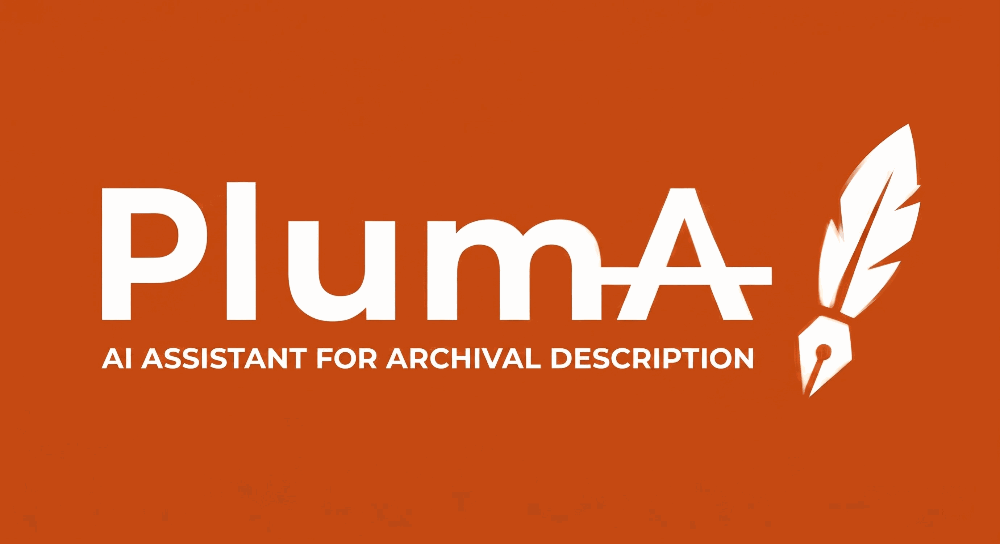

<p align="center">
  
</p>

# PlumA

**AI Assistant for Archival Description.**

Asistente de descripción archivística asistida por IA, ejecutable en
local, sin enviar documentos a la nube.

A partir de un documento digitalizado (PDF con o sin OCR, DOCX, imagen
escaneada, texto), el asistente propone valores para los campos de las
normas internacionales del Consejo Internacional de Archivos:

- **ISAD(G)** — descripción archivística
- **ISAAR(CPF)** — registros de autoridad
- **ISDF** — descripción de funciones
- **ISDIAH** — instituciones que custodian fondos

El archivero revisa las propuestas, corrige lo que haga falta y copia
los valores a su sistema descriptivo habitual (ArchivesSpace, AtoM,
cualquier otro).

> **PlumA forma parte de una suite de herramientas archivísticas
> de código abierto** que se está desarrollando para tareas comunes
> de los equipos de archivo (descripción, autoridades, vocabularios,
> integración con sistemas descriptivos, generación de instrumentos).
> Esta es la primera herramienta publicada de la suite.

## Características principales

- **Procesamiento local**. Tras instalar dependencias/modelos, los documentos no salen del equipo. El motor de IA
  (Ollama) y la aplicación corren en contenedores Docker sin red
  saliente más allá de la red interna entre servicios.
- **Trazabilidad honesta**. Cada propuesta incluye el fragmento literal
  del documento que la justifica y un indicador de confianza. Si el
  asistente no tiene evidencia para un campo, lo deja vacío.
- **Modos de extracción**. "Esencial" (6 campos clave, ~15 s), "Completo"
  (todos los campos extraíbles de la norma), o "Personalizado" (elegir).
- **Detección de tipo documental**. El asistente reconoce oficios, actas,
  escrituras notariales, libros sacramentales, etc., y ajusta la
  extracción al tipo detectado.
- **Multimodal**. Procesa PDF con texto, PDF escaneado y imágenes. Si el
  OCR del PDF es de baja calidad, el asistente prefiere leer directamente
  la imagen.
- **Agnóstico al sistema descriptivo**. La salida es estándar (JSON, CSV,
  EAD, EAC-CPF) y el archivero la lleva a su sistema como prefiera.

## Instalación

**Requisito único: Docker.** Descárgalo gratuitamente en
<https://www.docker.com/products/docker-desktop/> si aún no lo tienes.

Una vez Docker esté instalado y arrancado:

- **Windows**: doble clic en `instalar.bat`.
- **Linux / macOS**: `chmod +x instalar.sh && ./instalar.sh`.

El instalador detecta automáticamente si ya tienes Ollama funcionando
en tu equipo:

- Si **no** tienes Ollama, lo levanta dentro de Docker y descarga el
  modelo por defecto (unos 4-5 GB la primera vez).
- Si **ya** tienes Ollama con modelos descargados, la aplicación se
  conecta directamente a él sin duplicar nada.

Al terminar, abre el navegador en <http://localhost:8082> salvo que hayas cambiado `PUERTO` en `.env`.

Guía detallada y solución de problemas en [INSTALACION.md](INSTALACION.md).

Para detener: `detener.sh` / `detener.bat`.
Para eliminar todo: `desinstalar.sh` / `desinstalar.bat`.

## Uso rápido

1. Arrastrar un documento a la zona de carga, o seleccionar uno de los
   ejemplos incluidos.
2. Elegir la norma y el modo de extracción.
3. Revisar las propuestas. Cada campo muestra el fragmento fuente y un
   indicador de confianza.
4. Editar donde haga falta. Copiar los valores al sistema descriptivo
   de destino, campo por campo.

## Arquitectura

```
pluma/
├── backend/              código Python (FastAPI)
│   ├── app/
│   │   ├── extractor.py      núcleo: esquema + documento → propuesta
│   │   ├── router.py         validación y preparación de entrada
│   │   ├── identificador_tipo.py
│   │   ├── api.py            endpoints REST
│   │   ├── bootstrap.py      preparación automática del modelo
│   │   ├── llm.py            cliente Ollama
│   │   └── main.py
│   ├── Dockerfile
│   └── pyproject.toml
├── schemas/              normas y catálogos en YAML editable
│   ├── isad-g.yaml
│   ├── isaar-cpf.yaml
│   ├── isdf.yaml
│   ├── isdiah.yaml
│   └── tipos-documentales.yaml
├── frontend/             interfaz web estática (HTML, CSS y JavaScript)
├── ejemplos/             documentos de prueba
├── Modelfile             receta del modelo especializado Ollama
└── docker-compose.yml
```

## Esquemas editables

Los cuatro esquemas de norma y el catálogo de tipos documentales son
ficheros YAML en la carpeta `schemas/`. Un archivero puede ampliar o
afinar estos ficheros para su contexto (añadir tipos documentales
específicos, matizar instrucciones) sin tocar código ni reconstruir la
imagen Docker. Basta con reiniciar el contenedor de la aplicación.

## Licencia y autoría

AGPL-3.0-or-later. Ver [LICENSE](LICENSE).

La interfaz incluye una referencia visible al desarrollo por Víctor Villapalos y un enlace al texto de licencia servido localmente como `LICENSE.txt`.

Esta es la versión libre del proyecto. Hay una versión comercial
pensada para instituciones con necesidades de procesamiento por lotes,
auditoría formal, integraciones avanzadas y soporte.

## Estado del proyecto

Versión 0.3.0-alpha — alpha pública. No apto todavía para
entornos de producción. Las pruebas institucionales son bienvenidas
por contacto directo.

## Autor

Víctor Villapalos Sánchez.


## Endurecimiento aplicado en esta versión

Esta versión incorpora medidas adicionales de seguridad para una release local/formativa:

- Rechazo temprano de cuerpos HTTP grandes antes del parseo multipart/JSON.
- Eliminación del fallback de detección por extensión en `router.py`.
- Validación anti ZIP-bomb para DOCX.
- Límites de píxeles/bytes para imágenes y renderizado PDF.
- Procesamiento PDF/DOCX/imagen en proceso hijo con timeout y límite de memoria.
- Límite de concurrencia para `/api/describir`.
- Tokens CSRF con TTL, almacén acotado y comprobación de mismo origen local exacto.
- Restricción de `OLLAMA_URL` a destinos locales salvo `ALLOW_REMOTE_OLLAMA=true`.
- Desactivación de `/docs`, `/redoc` y `/openapi.json` en FastAPI.
- Validación defensiva de JSON devuelto por el modelo.
- Sanitización de CSV frente a fórmulas.
- Endurecimiento adicional del contenedor de aplicación.
- Workflow de seguridad con Ruff, pytest, `pip-audit`, build Docker y Trivy.

Sigue siendo una herramienta local de apoyo y formación, no una solución
certificada para producción ni para tratamiento masivo de documentación sensible.


## Ajuste de longitud y contexto

Esta versión amplía los límites para descripciones archivísticas extensas. La interfaz no impone un límite de caracteres sobre los campos editables; los límites relevantes están en el backend y en la ventana de contexto del modelo local.

Variables principales en `.env`:

- `MAX_LONGITUD_TEXTO_EXTRAIDO`: texto máximo extraído del documento que puede entrar en el prompt. Valor por defecto: `800000` caracteres.
- `OLLAMA_NUM_CTX`: ventana de contexto solicitada a Ollama. Valor por defecto: `32768` tokens.
- `OLLAMA_NUM_PREDICT`: longitud máxima de respuesta del modelo. Valor por defecto: `8192` tokens.
- `MAX_LONGITUD_VALOR_LLM`: longitud máxima admitida para cada valor propuesto por el modelo. Valor por defecto: `50000` caracteres.

Aumentar estos valores puede mejorar la precisión en documentos largos, pero también incrementa consumo de memoria, tiempo de respuesta y carga del modelo. Para resultados extensos en “Título” y “Alcance y contenido”, conviene usar modelos con ventana de contexto amplia y suficiente RAM.


### Nota sobre campos largos

Los campos editables de la interfaz se autoajustan para mostrar textos largos, especialmente `Título` y `Alcance y contenido`. Si se amplían los límites de contexto del modelo, la interfaz recalcula la altura después de mostrar la pantalla de resultados para evitar recortes visuales.

## Interfaz bilingüe y apagado desde la UI

La interfaz incorpora un selector **ES/EN** en la cabecera. Este selector traduce la interfaz, botones, mensajes y las etiquetas normativas más habituales mostradas al usuario. Además, el idioma seleccionado se envía al backend como `idioma_salida`, de modo que las propuestas redactadas por el modelo se generan en el idioma activo de la interfaz.

Para obtener una descripción en inglés, seleccione **EN** antes de procesar o pulse **Reprocesar** después de cambiar el idioma. Las evidencias se mantienen siempre como fragmentos literales del documento original para preservar la verificabilidad.

También se ha añadido un botón **Apagar** en la cabecera. Por seguridad, no monta el socket Docker ni ejecuta comandos del anfitrión: el botón detiene el proceso del servidor local de la aplicación. En el perfil `bundled`, el contenedor de Ollama puede quedar activo hasta ejecutar `detener.bat`, `detener.sh` o `docker compose down`.

El modelo base por defecto es `gemma4:e2b`. Puede cambiarse en `.env` mediante `MODELO_BASE`, pero debe existir en Ollama o poder descargarse en el perfil correspondiente.


## Documentación

- [`INSTALACION.md`](INSTALACION.md) — instalación paso a paso (Windows, Linux, macOS).
- [`CUMPLIMIENTO.md`](CUMPLIMIENTO.md) — cumplimiento normativo, RGPD, gobierno del dato.
- [`SECURITY.md`](SECURITY.md) — política de seguridad y reporte de vulnerabilidades.
- [`SECURITY_HARDENING.md`](SECURITY_HARDENING.md) — endurecimiento de seguridad aplicado.
- [`KNOWN_ISSUES.md`](KNOWN_ISSUES.md) — problemas conocidos y riesgos residuales reconocidos.
- [`CONTRIBUTING.md`](CONTRIBUTING.md) — cómo contribuir al proyecto.
- [`CLA.md`](CLA.md) — acuerdo de licencia para contribuyentes.


## Estado del proyecto

**Versión 0.3.0-alpha — alpha pública.** Esta versión está pensada
para evaluación por archiveros, formación, demostraciones y entornos
de prueba controlados. **No es apta para producción** sin auditoría
previa y sin las acciones que se describen en `SECURITY_HARDENING.md`
("Pendiente para subir el nivel a auditoría profesional").

Lo que se garantiza en esta versión:

- El procesamiento es local (sin telemetría, sin envío a la nube).
- Las medidas de seguridad razonables están aplicadas (CSRF activo,
  límites pre-parseo, sandbox de procesos para parsers, validación
  de imagen-bomba y zip-bomb, restricción de Ollama remoto).
- Tests automáticos en CI con auditoría de dependencias y escaneo
  de imágenes Docker.
- Documentación honesta sobre lo que falta (ver `KNOWN_ISSUES.md`).

Lo que no se garantiza todavía:

- Auditoría profesional externa.
- Pruebas multiplataforma exhaustivas (desarrollado en Windows con
  Docker Desktop; pendiente probar en Linux y macOS de forma
  sistemática).
- Fijación criptográfica de imágenes Docker por digest.
- Texto íntegro de la AGPL-3 en el `LICENSE` (el aviso oficial sí
  está; el texto largo debe completarse antes de etiquetar la
  release pública).


## Licencia

PlumA se distribuye bajo la **GNU Affero General Public License v3**
(AGPL-3.0). Ver fichero `LICENSE`.

Esta licencia permite usar, modificar y redistribuir el software
libremente, incluso comercialmente, con la condición de que cualquier
modificación sustancial que se ofrezca como servicio en red debe
hacerse también disponible bajo la misma licencia.
